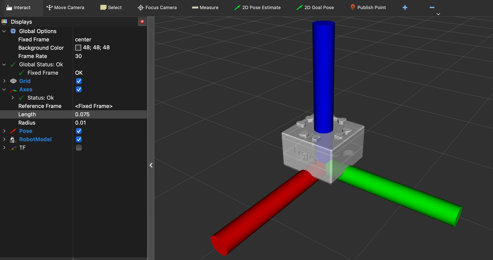

# toio_description

## Introduction

`toio_description` provides a 3D model of the [toio](https://toio.io/) for visualization.



## Requirements

I checked this package on the following environment.

- Ubuntu 24.04
- ROS 2 Jazzy

## Build

```bash
mkdir -p ~/dev_ws/src
cd ~/dev_ws/src
git clone https://github.com/atinfinity/toio_description.git
cd ..
rosdep install -y -i --from-paths src
colcon build --symlink-install
source ~/dev_ws/install/setup.bash
```

## Launch toio_description

```bash
ros2 launch toio_description robot_description.launch.py
```

## License

### Source code

- Apache License, Version 2.0

### 3D model

- CC BY-ND 4.0

The [meshes/toio/toiocorecube_v001.stl](meshes/toio/toiocorecube_v001.stl) is distributed at <https://toio.github.io/toio-spec/en/docs/hardware_shape/>.

Original image and 3D data by Sony Interactive Entertainment Inc. is licensed under CC BY-ND 4.0.
- <https://github.com/toio/toio-spec>
- <https://creativecommons.org/licenses/by-nd/4.0/>