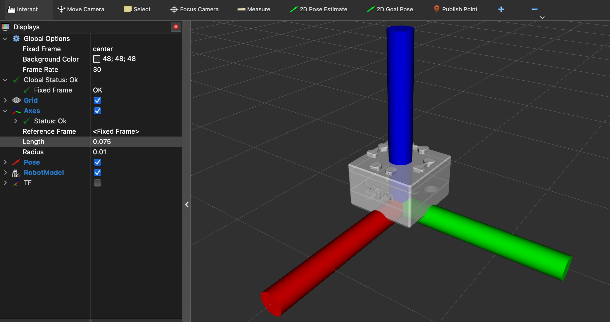

# toio_description

## Introduction

`toio_description` provides a 3D model of the [toio](https://toio.io/) for visualization.



## Requirements

I checked this package on the following environment.

- Ubuntu 24.04
- ROS 2 Jazzy

## Build

```bash
mkdir -p ~/dev_ws/src
cd ~/dev_ws/src
git clone https://github.com/atinfinity/toio_description.git
cd ..
rosdep install -y -i --from-paths src
colcon build --symlink-install
source ~/dev_ws/install/setup.bash
```

## Launch toio_description

```bash
ros2 launch toio_description robot_description.launch.py
```

## Xacro arguments

| argument | default | description |
| --- | --- | --- |
| `robot_name` | `toio` | Gazebo model name used to scope the gz topics (`/model/<robot_name>/...`), so that several cubes can be spawned without sharing topics |
| `led_duration_ms` | `0` | Lighting time of the indicator LED in milliseconds. `0` keeps it lit until the next command, `10`-`2550` turns it off once the time has elapsed |
| `led_light_intensity` | `1.0` | Intensity of the light of the lamp while it is lit. `0` leaves the lamp lighting up only itself, without casting color on the mat around the cube |

## Indicator lamp

`led_link` models the lamp of the cube. Following
[the specification](https://toio.github.io/toio-spec/en/docs/ble_light/), which
gives the cube one lamp on its bottom, it is the ball at the rear of the
underside that also serves as the function button, 11.1 mm behind the center of
the cube. Only the cap that reaches below the flat underside is visible, so the
lamp is best seen from a low angle, as on the real cube.

A point light inside the body makes the lamp wash the mat around the cube in
its color, faintly and over a good part of it. It starts switched off and is
driven together with the visual.

Both are driven in Gazebo by the `ToioLedSystem` plugin of
[toio_gazebo](https://github.com/atinfinity/toio_gazebo), which subscribes to
`/model/<robot_name>/led`. See the toio_gazebo README for how that is bridged to
the `toio/led` topic of the real cube.

## License

### Source code

- Apache License, Version 2.0

### 3D model

- CC BY-ND 4.0

The [meshes/toio/toiocorecube_v001.stl](meshes/toio/toiocorecube_v001.stl) is distributed at <https://toio.github.io/toio-spec/en/docs/hardware_shape/>.

Original image and 3D data by Sony Interactive Entertainment Inc. is licensed under CC BY-ND 4.0.
- <https://github.com/toio/toio-spec>
- <https://creativecommons.org/licenses/by-nd/4.0/>